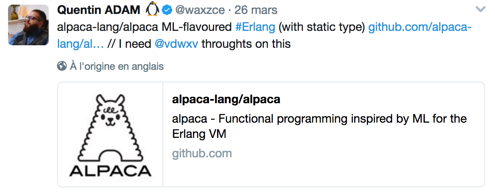

% Laissons le **Lama** cra(*s|c*)her, \newline à la découverte du langage **Alpaca** 
% Xavier Van de Woestyne \newline __DernierCri__
% {width="50px"} \newline __LilleFP4__ - 04 Mai 2017

# Moi-même :v 

-  [**@vdwxv**](https://twitter.com/vdwxv) sur Twitter, [**@xvw**](https://github.com/xvw) sur Github ;
-  j'ai un site web tout pourri (https://xvw.github.io)
-  Erlang, [**OCaml**](http://ocaml.org/), [Elixir](http://elixir-lang.org/), [Ruby](https://www.ruby-lang.org/fr/) (et depuis peu... [Clojure](https://clojure.org/)) etc. ;
-  Développeur à [**DernierCri**](https://derniercri.io/) ;
-  je suis **Belge** (donc je n'ai pas voté **Macron** :D).

> Si vous avez un talk, n'hésitez pas à nous (LilleFP) le proposer ! On est open !

-  j'aime, à mon grand malheur, dire du mal (gratuitement) des 
   technologies que je n'aime pas... désolé (pour les gens que j'ai pu 
   froisser dans le passé)

# Sommaire 

Rapidement, **Alpaca** est un nouveau langage, inspiré de **ML**, sur la **VM de Erlang**.

- Introduction : **Erlang** as a VM (Elixir, LFE, Reia etc.)
- Caractéristiques de **Alpaca**, présentations et thématiques
- Pourquoi Erlang n'est **pas** typé, viabilité du projet
- Conclusion + questions/réponses

> Ceci est un talk **interactif**, n'hésitez pas à m'interrompre en cas d'ambiguïté, de 
> dépit, ou de joie !

# Erlang

> Erlang est un langage de programmation, supportant plusieurs paradigmes : concurrent, temps réel, distribué. Son cœur séquentiel est un langage fonctionnel à évaluation stricte, affectation unique, au typage dynamique fort.

---

-  1986 chez **Ericsson**, libéré en 1998 ;
-  première implémentation dans l'excellent **Prolog** (et inspiration syntaxique) ;
-  articulé autour du modèle **Acteur** (de Carl Hewitt) ;
-  fonctionne sur une VM, **JAM**, ensuite **BEAM**.

> Un des rares langages où la syntaxe pouvait réellement poser un problème.

# BEAM : Bogdan/Björn's Erlang Abstract Machine

-  Implémentation manuelle de processus légers ;
-  utilise un glâneur de cellules ;
-  tolérante aux pannes ; 
-  distribuable _relativement_ facilement ;
-  Beaucoup de *success-stories* :
     -  Ericsson ;
     -  Facebook ; 
     -  WhatsApp ;
     -  CouchDB, Riak, RabbitMQ ;
     -  etc.

# BEAM, concrètement

-  Une machine virtuelle pour exécuter du Erlang (mais pas que !) ;
-  une interface de communication (**Ports** et **NIF's**) ;
-  un écosystème **riche** (**OTP** et ses **BIF's**) ;
-  un outillage solide pour permettre : 
     - La **concurrence** légère, _massivement_ ; 
     - la communication **asynchrone** ; 
     - l'isolation des processus ; 
     - la propagation d'erreurs ; 
     - l'évolution continue de systèmes ; 
     - **Distribuable par machine et par unité de calcul**
     - être **temps-réel-souple**.


---

Concrètement, Erlang et BEAM permettent de faciliter le développement 
d'applications à haute disponibilité, distribuables + _blabla promotionnel_.

## En fait ...
Erlang... c'est un peu comme **Go** ... 
[PREUVE (c'est un lien)](https://derniercri.io/tech-blog/concurrence-go-erlang)

---

> Si BEAM et Erlang tabassent autant, pourquoi avoir dû attendre 2012 pour avoir, enfin, 
> un langage avec une syntaxe plus moderne (et moins déroutante) ?

---

-  Pas de formalisation pour le langage ;
-  pas de formalisation pour ERTS (Erlang RunTime System).

## Ce qui implique : 
Les gens désirant créer un langage sur BEAM doivent dériver la sémantique de la VM...
fastidieux.

# Pourtant certains s'y sont essayés 

-  **Joxa** : le Clojure (:troll:) de BEAM ; 
-  **LFE** :  le Clojure de ..., l'exercice de parsing qui a évolué ;
-  **Efene** : le Python de BEAM ; 
-  **Reia** : le Elixir de BEAM ; 
-  **Elixir** : le Reia de BEAM ;
-  **EML** : le OCaml de BEAM ;
-  **MLFE/Alpaca** : le EML de BEAM.
-  et bien d'autres ...

Aujourd'hui, on s'intéresse à **Alpaca**


# Pourquoi cette présentation ?




# Sommaire de la présentation d'Alpaca 

> L'objectif n'est pas de faire une démonstration exhaustive 
> mais de présenter une démarche.

- Genèse du projet et motivations ;
- Processus de compilation ;
- syntaxe générale et fonctionnalités ; 
- système de type (ADT's + *row-polymorphism*) ;
- interopérabilité avec BEAM ; 
- typage des messages.

# Un projet démarré en 2016 

- **Jeremy Pierre** : architecte chez Askuity (Erlang + Scala)
- Alpaca est formellement un "début" de langage fonctionnel statiquement typé.

La motivation principale du langage est d'offrir un contexte d'exécution 
dans BEAM sur.

# Pourquoi Alpaca

- Bénéficier, dans BEAM, des avantages du typage statique (parfois manquant) ; 
- réduire, par extension, l'implémentation de tests unitaires.

## Mais... et Diaylizer ? 

-  Un outil discutablement utilisé ;
-  stories : **Coers** et **Mizur**. 

# Survol général 

- Inférence de types (Hindley-Milner) ;
- inspiré par les langages de la famille **ML** (Haskell, OCaml, Elm, SML) ;
- veut rester simple et compréhensible; 
- veut maximiser l'interopérabilité entre Alpaca et les autres langages de BEAM ;
- remettre au premier plan des éléments de programmation fonctionnelle ; 
- tests unitaires ... *inlinés* ;
- Exclusion du type *Any* !

# Ce que Alpaca ne fera sans doute jamais 

- Higher-kinded types (Je pense que Quentin en parlera dans son talk)
- Types dépendants (ouf, Alpaca va rester un langage utilisable pour faire des choses concrètes !)
- Typages des effets (ouf, Alpaca va rester lisible !)
- Polymorphisme Ad-hoc (zut...)

# Processus de compilation 

- Alpaca projete un module dans l'AST de Erlang ;
- le compilateur exécute ses optimisations et ses vérifications sur l'AST produit ;
- `mon_module.alp` devient `alpaca_mon_module.beam`.


> L'utilisation de l'AST de Erlang est une manière de palier à l'absence de 
> formalisation concrètes de BEAM et ERTS ! De plus, tout ce qui est *built-in* 
> en Erlang est directement convertit (listes, *maps*, *guards*).

# Syntax in a *nutshell*

```ocaml
module sample 

type option 'a = Some 'a | None 
let ( |> ) x f = f x # YOUHOU
let map _ None = None 
let map f (Some a) = Some (f a)

test "mapping de l'identité" = 
  let id x = x in 
  assert_equal (map id (Some 2)) (Some 2)
```

```ocaml
let assert_equal a b = 
  match (a == b) with 
    true  -> :ok 
  | false -> throw (:not_equal, a, b)
```

# Le typage de Alpaca

## Types Sommes : 

-  Polymorphisme paramétrique ;
-  types récursifs ;
-  disjonction (et pas que union discriminée).

```ocaml
type option 'a = Some 'a | None
type list 'a = Nil | Cons ('a , list 'a)
type madness_numeric = int | float 
```

---
## Types Produits

- Tuples de Erlang (où les accolades deviennent des parenthèses)
- **Row polymorphismes** :  *records* compilés en *Maps* (et avec les mêmes racourcis syntaxiques).

```ocaml
type couple 'a 'b = ('a, 'b)
{x = 12, y = "Hello Lille FP"}
```

# Sur le pattern-matching

Le pattern matching ne peut que déconstruire sur le même type.

```ocaml
match x with 
   0 -> "Zero"
 | x -> "Non Zero
```
- l'inférence fait son travail, x est un entier.


# Pourtant 

On préférera l'écriture : 

```ocaml 
match x with 
  0 -> "Zero"
  | x, is_integer x -> "Non Zero"
```

## Pourquoi ? 


# Interop everywhere !
Alpaca veut pouvoir communiquer avec d'autres langages de BEAM !

-  Dans le cadre d'une fonction (Alpaca) utilisée par un autre langage, il faut 
   minimiser les risques de mauvaise évaluation.

-  D'où l'intérêt de notre **type madness**, pour, par exemple, converver vers le 
   type `number` de Erlang.

> Triste mais nécéssaire !

# FFI's : Interop everywhere 2 ! 

```ocaml
beam :io :format ["Hello~n", []] with _ -> ()
beam :io_lib :format ["This will contain the integer 3:  ~w", [3]] 
    with cs, is_chars cs -> cs
```

## Formellement : 

```ocaml
beam 
  :module 
  :function
  [params list] 
  with (args list + guards) 
  -> return_type
```

> On suppose que si l'utilisateur entre des types randoms, c'est son soucis !

# Typage de messages (et des receveurs)

> Ou comment Erlang peut devenir comme Akka ... (~~inutilisable~~)

```erlang 
-module(test).

add(State) -> 
  receive 
   X -> add(State + x)
  end.

on_casse_tout() ->
  A = spawn(fun() -> add(0) end)
  A ! "Je suis une chaine de caractère donc... "
```

# Typage de messages (et des receveurs)

`receiver 'message_type 'return_type` force `pid 'message_type`.

- Les **receveurs** sont paramétrés par deux types
- les **PID's** sont reliés à leurs receveurs et stockent le type des messages.

> Les envois de messages incohérents sont donc attrapés à la compilation !

# Typesafe !
{width="300px"}


# Et niveau interopérabilité alors ? 


# Et donc, qu'en penser d'Alpaca ? 

## AMHA, les points positifs
- Le langage est raisonné de manière intelligente ; 
- il part d'un très très bon sentiment ;
- il promet d'être très beau ;
- il ne perd pas l'interopérabilité de vue ;
- il n'est pas trop ambitieux.

## AMHA, les questions en attente
- Comment typer les interfaces des **comportements OTP** ?
- *Quid* du HotCode reloading/swapping.

# Vouloir typer Erlang n'est pas une nouveauté 

- Actuellement, les types servent à décrire une interface ;
- ils peuvent éventuellement être vérifiés via Dialyzer...

# A Practical Subtyping System For Erlang

> One day Phil phoned me up and announced that a) Erlang needed a type system, b) he had written a small prototype of a type system and c) he had a one 
> year’s sabbatical and was going to write a type system for Erlang and “were we interested?” Answer —“Yes.”

> Phil Wadler and Simon Marlow worked on a type system for over a year and the results were published in [20]. The results of the project were somewhat
> disappointing. To start with, only a subset of the language was type-checkable, the major omission being the lack of process types and of type checking
> inter-process messages.

# Pourquoi ? 

Comme exprimé pour Alpaca : 

- Le Hotcode swapping (état de cohérence/incohérence)
- Erlang "comme COBOL" (historique + *code legacy*)

> Est-ce réellement viable de procéder à un typage de Erlang ? 

## Pistes éventuelles (mais un peu tristes)

- typage graduel 
- *Simple plymorphism* (à la Elixir)
- sacrifier certaines choses (soit le HSwapping, soit l'interopérabilité, à la Clojure)

# Et donc, que penser de Alpaca ? 

- Un projet très intéressant ;
- qui vaut la peine d'être suivi ;
- pourquoi ne pas y contribuer ? (Ils sont très ouverts et font bien les choses) ;
- mais est-ce que ce sera réellement utilisable ? (Bonne question !)

> Quoi qu'il en soit, à mon sens il faut valoriser ce genre de projets, qui 
> même si à mon sens, ils seront très dur à faire aboutir, il n'en reste pas 
> moins très **cools** !


# Fin ... 

- Si vous avez des questions ;
- ou des remarques :'( 

Merci pour votre attention et votre intérêt potentiel !