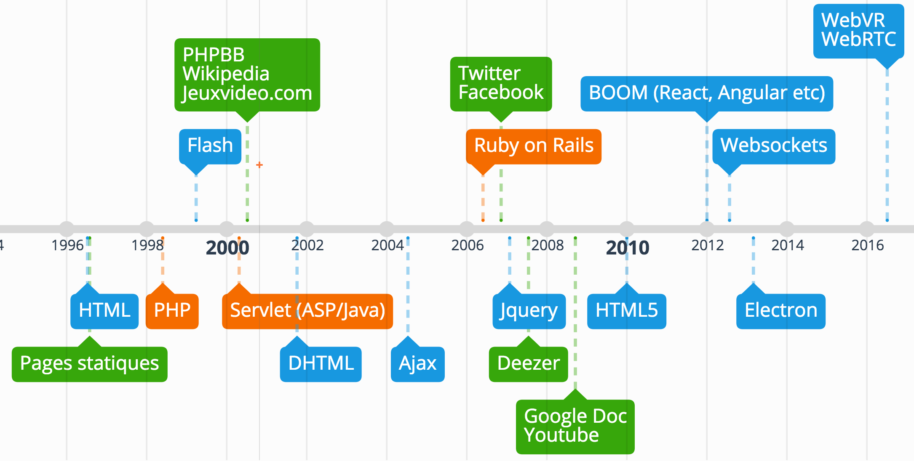
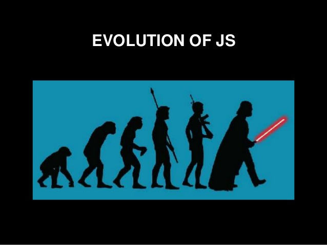
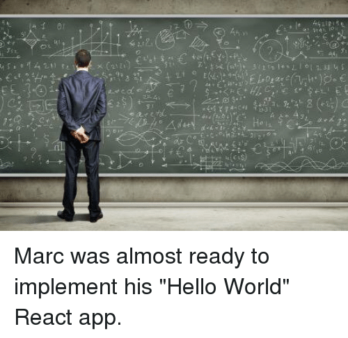
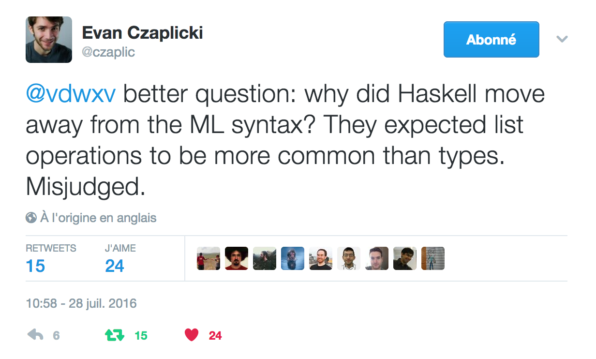

% Des applications web modernes avec **Elm** \newline Le **web**, de hier à aujourd'hui
% Xavier Van de Woestyne
% **Déjeuners technologiques ~ Université de Lille 1** \newline Novembre 2017


### Moi
- **Xavier Van de Woestyne** (https://xvw.github.io)
- **@xvw** sur Github et **@vdwxv** sur Twitter
- Développeur chez **Fewlines** (Elm/Elixir/React)
- Meetup **LilleFP**


### de 1999 à aujourd'hui
- **OCaml**/F#, Haskell, **Elixir/Erlang**, **Elm**, Idris, Nim, Rust, Racket
- **PHP**, **Ruby**, **Go**, Java/C#, JavaScript, C/C++
- Beaucoup beaucoup de web, mais pas que

### Et vous ? (Web ? Back/Front ?)

---

### Objectifs de la présentation

- Survoler l'évolution des applications web
- Comprendre les évolutions technologiques liées au web
- Comprendre le contexte d'exécution du web
- Présenter Elm (buts, avantages et ... inconvénients)


### Avant-propos / Disclaimer

- Une présentation **interactive**
- Peu de raisonnement sur le back-end "seul"
- Opinions tranchées (mais sujettes au **débat**)
- Une présentation **dur** à préparer


## Le web, des 90's à aujourd'hui



---

### De 90 à aujourd'hui, les changements

- Plus de *devices*
- Sur connecté (3/4G, Wifi, Smartphones)
- Le Cloud


# Des pages aux applications Riches


## Plusieurs solutions

- **Embarquement de VM** : Applets/Flash/Silverlight
   - Souvent propriétaire
   - Dur à maintenir
   - Non universel (**ie** : Vous devez posséder Flash Player)
- **JavaScript**
   - Universel (mais implémentation variable)
   - Donc peut être considéré comme un ByteCode

# De DHTML à ES2015 (16, 17, 18)

---

-  Le web est transactionnel (client <-> serveur)
-  DHTML (dénormalisé jusqu'à ECMAScript)
-  AJAX : **révolution !**
-  JQuery (normalisation + AJAX + Selecteurs)
-  **NodeJS** + NPM
-  **ES2015** (Initialement peu supporté)
-  Babel
-  Explosion du JavaScript
    - Ember
    - React
    - Angular

---



## Pleins d'outils "puissants" pour faire des applications modernes

- AJAX
- COMET/WebSocket/Server-sent Event
- LocalStorage (IndexDB)
- WebWorker, ServiceWorker
- API Audio
- Canvas/WebGL
- Promesses/Async Await
- Modules
- etc.


# Entre Client et Serveur

---

## Deux approches

### Tierless

> Link, Hop, Ocsigen, Opa, Meteor, GWT, Tapestry, StipJS

### Multitiers

> Ce que j'ai choisi de couvrir pour cette présentation


# Mais... Qu'est-ce qu'une application web "moderne" ?

---

- **Responsive** (et donc portable)
- **Réactive**
- Canal de notification "**temps réel** souple"/discret
- Tenant compte de son **contexte d'exécution** (précédent/suivant, onglets)
- **Accessible** (partout et pour un maximum de gens)

---

- **Responsive** : CSS + *MediaQueries*
- **Temps réelle** : WebSocket/Server-sent-event
- **Contexte d'exécution** : Continuations et BroadcastChannel
- **Accessible partout** : LocalStorage + Service Worker
- **Accessible pour un maximum de gens** : Aria + UX

- **Réactive** ? Les mutations sur le DOM sont coûteuse
   - **DOM Virtuel**
   - **DOM Incremental**


JavaScript semble être capable de couvrir nos problématiques

# Au delà de JavaScript

---

## Pourquoi : verbeux

```JavaScript
function hello(to) {
  return `Hello ${to}`
}
```

## Pourquoi : complexe



## Pourquoi : étrange...


```JavaScript
Array(16).join("lol" - 2) + " Batman!";
```

```shell
'NaNNaNNaNNaNNaNNaNNaNNaNNaNNaNNaNNaNNaNNaNNaN Batman!'
```

## Pourquoi : étrange ... 2

`undefined is not a function`


## Pourquoi : beaucoup de raisons subjectives

- Typé dynamiquement
- Fait beaucoup de conversions implicites
- Repose sur beaucoup de **magie**
- Discutablement lisible ...


# JavaScript, comme un ByteCode (avant WebAssembly)

---

- CoffeeScript
- BuckleScript
- Js_of_OCaml
- HaXe
- ClojureScript
- **Elm**
- PureScript
- Fable
- Et plein d'autres !


# Elm

---

## Elm in a nutshell

Créé par **Evan Czaplicki** en 2012

- Langage fonctionnel (**réactif**), statiquement typé et concurrent
- Qui compile vers JavaScript
- Des erreurs expressives
- Accessible et performant
- Utilisé industriellement
- **Interdisant** (au mieux) les erreurs au *Runtime* (List.head, par exemple)
- Facile à apprendre
- Ecrit majoritairement en **Haskell**
- respectant la tradition des langages **ML** (et proche de Haskell)

---



---

Issu de la recherche mais évoluant grâce à la communauté.

### Installation

`npm install -g elm`

-  `elm-repl`
-  `elm-reactor`
-  `elm-make`
-  `elm-package` <**semver** **enforced**>

Et une bibliothèque standard qui couvre "les besoins classiques" d'une
application web, le **Html** et ses attributs, par exemple.


## Unités de compilation : les modules

- Un module est un espace nom
- Ils intègrent une notion d'expostion
- Ils permettent de fragmenter le code

## Typé statiquement

- Types primitifs (liste, nombres, booléens, chaines de caractères etc.)
- Polymorphisme paramétrique
- Types algébriques
- Alias de types

`direBonjour : String -> String -> Html.text`

`direBonjour : Prenom -> Nom -> Html.text`

## Les bénéfices des langages statiquement typés

- Sécurité
- Outil de design
- Construction algébriques (monades/foncteurs applicatifs)


## A la différence de Haskell

-  Pas de classes de Types (définissable)
-  Pas de typage "avancé" (GADT's, High Kinder Types)
-  Pas de compréhension
-  Strict (ouf !)

---


# La Elm Architecture

---

## Functional Reactive Programming

> En informatique, la programmation réactive est un paradigme de programmation visant à
> conserver **une cohérence** d'ensemble en **propageant** les modifications d'une source réactive
> (modification d'une variable, entrée utilisateur, etc.) aux éléments dépendants de
> cette **source**.


### En Haskell, ça voudrait dire :
- Signaux
- Monades
- Et pourquoi pas des Flèches

## En Elm

```haskell
main : Platform.Program Never model msg
main =
    Html.program
        { init          : (model, Cmd msg)
        , update        : msg -> model -> (model, Cmd msg)
        , view          : model -> Html msg
        , subscriptions : model -> Sub msg
}
```

Il existe plusieurs formes de programmes, à utiliser en fonction du besoin !

---


---


# Demo \newline (très rapide, pour comprendre l'idée)

---

## Les Souscriptions et les Commandes


Une manière "commode" de *wrapper* des effets de bords :

-  **Commande** : Requête un effet
-  **Souscription** : Remonte le résultat de l'effet, sous forme de message


## Interop avec JavaScript

- Via les **flags** (uniquement au boot de l'application)
- via les **ports** (des modules spécifiques) :

```haskell
port getTree : File.Path -> Cmd msg
port retreiveTree : (File.Tree -> msg) -> Sub msg
```

> Le seul cas de Runtime erreur "possible"

## Et côté JavaScript

```javascript
import elm from '../../src/Main.elm'

const flags = {..}
const container = document.getElementById('app');
const elmApp = elm.Main.embed(container, flags);

elmApp.ports.getTree.subscribe((pwd) => {
  const tree = onRécupèreLeTreeEnJavaScript
  elmApp.ports.retreiveTree.send(tree)
});
```

# Un exemple de projet : Qian

---

## Points forts


- Syntaxe élégante (et très claire)
- Courbe d'apprentissage très souple
- Modularisable
- Error Driven Developement
- Performant et sûr
- Elm-format, bon support dans les éditeurs
- Beaucoup de ressources et bien documenté
- le déboggueur "pas à pas"

## Points faibles

- Peu de communication sur la version suivante
- Gros **?** sur la définition des commandes et des souscriptions
- Raisonnement sur l'architecture de code "complexe" quand l'application grandit


# Conclusion

---

- **Production Ready**
- Facile à bootstrapper et à utiliser
- Avec Elixir et Phoenix, la communication bi-directionnelle est un véritable plaisir

### Comment s'y mettre ?

Faites au maximum des projets personnels (MVP).  
Un Github bien rempli vaut, parfois, mieux qu'un CV.

# Merci !\newline questions, remarques etc?
