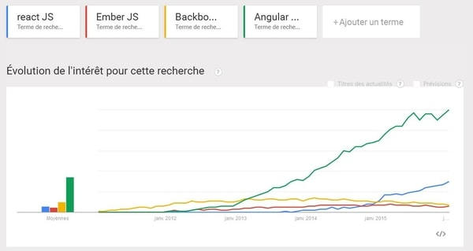
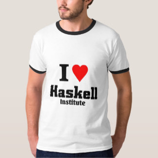
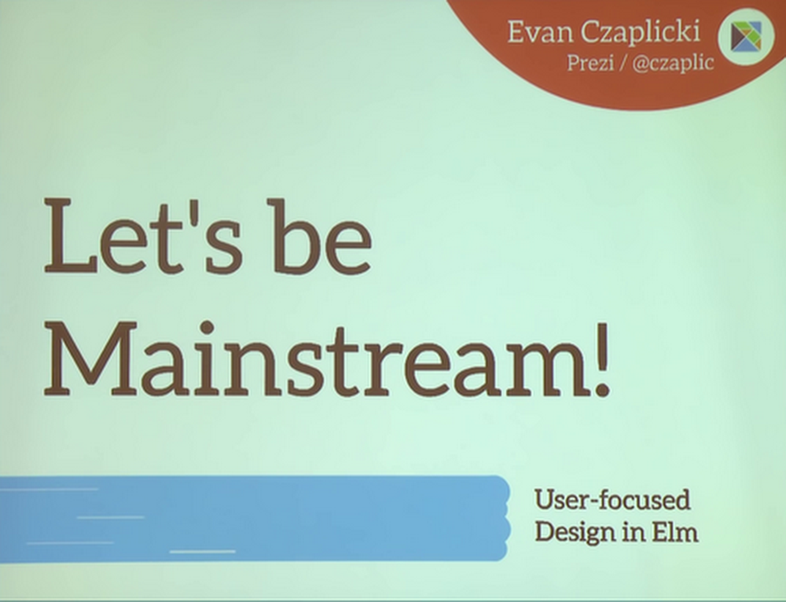
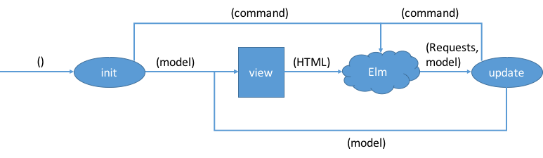

% La gentille introduction à Elm
% {width=80px}
% Raphaël Pallies, Xavier Van de Woestyne \newline \newline LilleFP3


# Flash, JavaScript, Silverlight (:troll:)

{width=320px}

---

## Maintenant on veut :

- Des Single-page-app's ;
- super réactive ;
- responsives ;
- sans temps de chargements (fait par le serveur) mais par des *spinners*.

---



---


# Elm in a nutshell

Créé par **Evan Czaplicki** en 2012

- Langage fonctionnel (réactif), statiquement typé et concurrent;
- qui compile vers JavaScript (comme d'autres) ;
- des erreurs expressives ;
- accessible et performant ;
- utilisé industriellement ;
- interdisant (au mieux) les erreurs au *Runtime* ;
- facile à apprendre ;
- respectant la tradition des langages **ML** (et proche de Haskell).


---


---

> Issu de la recherche mais évoluant grâce à la communauté.

# Typé statiquement

- Types primitifs (liste, nombres, booléens, chaines de caractères etc.) ;
- polymorphisme paramétrique ;
- types algébriques ;
- alias de types.

`direBonjour : String -> String -> Html.text`

`direBonjour : Prenom -> Nom -> Html.text`

# Functional Reactive Programming

> En informatique, la programmation réactive est un paradigme de programmation visant à
> conserver **une cohérence** d'ensemble en **propageant** les modifications d'une source réactive
> (modification d'une variable, entrée utilisateur, etc.) aux éléments dépendants de
> cette **source**.

**Wikipedia**

Par *functional*, on entend : "Faire de la programmation réactive avec des combinateurs
fonctionnels".

## Exemples :

- Dom Virtuel
- Interaction utilisateur

---


---

# FRP under the hood

- Signaux ;
- interface monadique ;
- *arrow calculus*.

---

{width=260px}

---



---

# Byebye signaux explicits, bonjour Elm-architecture




# Unités de compilation : les modules

- Un module est un espace nom ;
- il intègre une notion d'expostion ;
- il permet de fragmenter le code.


# Installation

- Via des *installers* (site officiel) ;
- via NPM :

```shell
       npm install -g elm
```

L'installation offre :

-  `elm-repl` ;
-  `elm-reactor` ;
-  `elm-make` ;
-  `elm-package`.

# Elm-repl

> Une boucle interaction pour tester des expressions Elm rapidement.


```shell
---- elm-repl 0.18.0 ------------------
 :help for help, :exit to exit, more at ...
---------------------------------------
> 1 + 1
2 : number
> List.foldl (+) 0 [1, 2, 3, 4, 5]
15 : number
>
```

# Elm-reactor

- Aide à la construction d'un projet Elm ;
- permet de lancer un serveur de test ;
- permet d'explorer les fichiers Elm ;
- recompile à chaque actualisation.

## Un Hello world en Elm

```haskell
import Html exposing (text)
main =
  text "Hello, World!"

```

# Utilisation de la Elm-architecture

## Programme
> Un programme cristallise la Elm-architecture,
> il représente le cycle de vie de l'application et
> son mécanisme de communication.

### Beginner programme

```haskell
beginnerProgram :
    {
        model : model,
        view : model -> Html msg,
        update : msg -> model -> model
    } -> Program Never
```

---

- Un programme est généralement le point d'entrée d'une application ;
- il existe d'autre programme plus fins.

> Le *beginnerProgram* exprime une idée simple de la Elm-architecture. Chaque
> interaction (clique par exemple) du programme produit **un message**. Le message
> est envoyé à **l'update** qui, sur base du **modèle** courant, produit un nouveau
> modèle. **La vue** se regénère sur base du nouveau modèle. Ces actions se répètent
> indéfiniment.


# Représentation du HTML avec des fonctions

-  `tag [attr_list] [children_list]` : tag normal ;
-  `text "mon texte"` : noeud textuel (PCDATA).

# Live-coding !

-  Un compteur réactif,
-  une liste de présentations !

> Gros gros challenge, effet **WHAOU** garantit.

# History : déboguer vos programmes Elm

-  Permet de rejouer des états de l'application ;
-  permet d'observer le modèle à des états donnés ;
-  permet d'importer/exporter des collections d'états. (Génial pour demander (ou prodiguer) de l'aide !)

# Ecosystème et communauté

-  Elm-package : gestionnaire de paquet de Elm ;
-  Awesome-elm : liste de ressources Elm ;
-  beaucoup de tutoriels/exemples ;
-  beaucoup d'intégrations dans des éditeurs ;
-  Elm-test ;
-  Elm-format (un peu extrême) ;
-  Elm-router, Elm-Lazy etc.


# Points forts

-  Facile à apprhénder ;
-  intègre des notions de signalétique discrète ;
-  un langage à l'écoute de sa communauté ;
-  Type-safe et élégant !

# Points faibles

-  Elm-architecture non composable :'( ;
-  peu de bibliothèques (et parfois une documentation rugueuse) ;
-  absence de polymorphisme add-hoc (ce qui implique de la répétion... parfois) ;
-  a force de vouloir être "trop *mainstream*", le développeur perd des outils ;
-  les dates et les timezone :troll: !

# Conclusion

- Elm c'est cool ! Faites en !
- Observez PureScript ...


## Bonus : comment être efficient en Elm ?

## QUESTIONS ? REACTIONS ? AFFIRMATIONS ?
