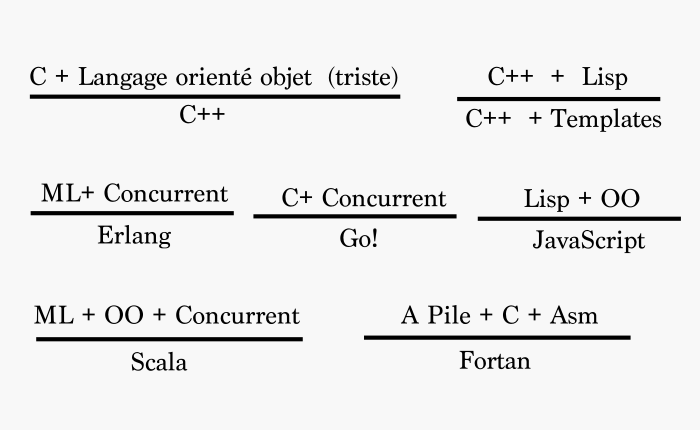
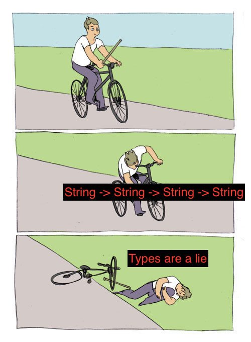

% Le langage F# \newline Retour vers le futur sur la planète .NET
% **Xavier Van de Woestyne**
% Lille.NET 1 - Janvier 2018

### Moi
- **Xavier Van de Woestyne** (https://xvw.github.io)
- **@xvw** sur Github et **@vdwxv** sur Twitter
- Développeur chez **Fewlines** (Elm/Elixir/React)
- Meetup **LilleFP**

### de 1999 à aujourd'hui
- **OCaml**/F#, Haskell, **Elixir/Erlang**, **Elm**, Idris, Nim, Rust, Scheme
- **PHP**, **Ruby**, **Go**, Java/C#, JavaScript, C/C++
- Beaucoup beaucoup de web, mais pas que
- Pas vraiment de .NET (en vrai)

---

## Objectifs de la présentation

- Proposer une raison **valable** de s'intéresser à F#
- Raisonner le poids des **syntaxes** et des **concepts**
- Survoler un langage **fonctionnel**
- Parler de **typage** (en règle générale)
- Montrer ma joie de voir un **meetup** .NET a Lille

### Ce que je ne ferai pas
- Une présentation exhaustive des fonctionnalités/concepts du langage
- Présenter les annotations de compilation et les directives pré-processeurs
- M'étendre sur le modèle objet


# The 8 languages theorem, \newline relaxing the learning curve for free \newline  ... \newline ©XHTMLBoy

## Il sait ... tout sur tout :/

{width=80px}

> Comment produire un feedback intelligent sur énormément de langages ,
> de Scala à C en passant par Go, Haskell, Coq, Scheme, JavaScript, OCaml, etc.

- Connaissance de tous les langages ?
- Connaissances d'un langage qui couvre tout ? (**C++**, par exemple)
- Bac + 20000 en Informatique théorique (abstractions avancées)

## Qu'est-ce qu'un langage ?

- Une (ou plusieurs) syntaxe(s)
- Une collection de concepts
- Un écosystème
- Un contexte d'exécution

## Qu'est-ce qu'un langage ?

- Une (ou plusieurs) syntaxe(s) **transposable par mimétisme**
- Une collection de concepts
- Un écosystème **peu nombreux et récurrent dans leurs formes**
- Un contexte d'exécution **peu nombreux (fondamentalement)**

> La vraie difficulté réside dans l'assimilation des concepts

### Disclaimer : JavaScript/Frameworks

## Vers une construction incrémentale du savoir

- Un **assembleur**
- Le **C**
- Un Lisp, **Scheme**, **Common Lisp**, **Clojure**
- Un langage orienté objet (mal pensé), **C#**, **Java**
- Un langage orienté objet dynamique, **Smalltalk**, **IO**, **Ruby/Python**
- Un langage concurrent, **Ada**
- Un langage ML, **OCaml**, **Haskell**, **F#**
- Un langage à pile, **Forth**, **Factor**

> Et un assistant de preuves... mais bon... **Coq**, **Agda**


## Par exemple

{width=600px}

## Concrètement

### Etendre sa palette de langages offre de la flexibilité pour l'apprentissage
### Et permet potentiellement de mieux comprendre sa technologie principale


# Le langage F\# \newline (oui... enfin :v)

---

### Décris par un reporter comme étant :

> "the most original new face in computer languages since Bjarne Stroustrup developed
> C++ in the early 1980s."


## FSharp in a nutshell

- Inventé en 2005, a Microsoft Cambridge par **Don Syme**
- F de F# pour "System F" (blabla sur le lambda-calul)
- Fortement inspiré par OCaml
- Un langage fonctionnel, statiquement typé (à la ML)
- Un langage orienté objets expressif
- Multi-platforme avec interopérable avec .NET **relativement** facilement
- Incubateur de fonctionnalités pour C#
- Bon support dans les éditeurs

## Les points faibles

-  Les solutions de .NET
-  Il faut parfois chatouiller la platforme pour l'interopérabilité
-  Confusion entre les espaces noms et les modules
-  Système de type riche par rapport à C#, moins riche que OCaml et Haskell
-  Beaucoup de types primitifs "alias"

## Points forts

-  **Concis/Expressif**, peut d'artéfacts syntaxiques, **inférence de types**
-  **Commode**, beaucoup de tâche récurrente correctement encodées/encodables
-  **Sûr**, bien typé, compilateur intelligent, immutable par défaut et avec une bonne portée lexicale
-  **Concurrence/Asynchrone**, permet facilement le développement de programmes concurrents
-  **Interactif** (via un REPL)
-  Privilégie un style **fonctionnel** au delà d'un style **impératif**

## Un maximum d'expressions

> Les expressions gramaticales de F# sont du sucre syntaxique pour des
> constructions encodées plus naïvement (**for** par exemple)

## Un premier programme

```fsharp
module Playground

let hello firstname name =
    let completeName = firstname + " " + name
    printfn "Hello %s !" completeName

[<EntryPoint>]
let main argv =
    hello argv.[0] argv.[1]
    0
```

# Présentation syntaxique

## Variables, fonctions et valeurs

```fsharp
let a = 10
let b = 20

let f x y = x + y

let g x y z =
    let res = f x y
    res + z

let display = printfn "Hello World !"
let display' () = printfn "Hello World 2 !"
```

## Lambdas et fonctions d'ordre superieur

```fsharp
let sample = [1; 2; 3; 4]
let increment x = x + 1

let res = List.map increment sample
let res' = List.map (fun x -> x + 1) sample
```

Ne pas confondre **un langage purement fonctionnel** et un **langage**
**fonctionnel pur** (Haskell !)

## Application partielle et curryfication

```fsharp
let add x y = x + y
let add' = fun x -> fun y -> x + y
let incr = add 1 // (fun x -> fun y -> x + y) 1
```

- Héritage du $\lambda$-calcul
- Une contrainte qui à une conséquence assez sympa !

## Récursion et conditions

```fsharp
// Non terminale
let rec factorial x =
    if x = 0 then 1
    else x * (factorial (x - 1))

// Terminale
let factorial' =
    let rec aux acc x =
        if x = 0 then acc
        else aux (acc * x) (x - 1)
    aux 1
```
Permet aussi la récursion "mutuelle" avec `let rec x and y`

## Boucles impératives

```fsharp
let upTo n = for i = 0 to n do printfn "%d" i
let toZero n = for i = n downto 0 do printfn "%d" i

let printIntList list =
    for element in list do
        printfn "%d" element
```
- `+ while do`

Ces constructions peuvent étendre énormément de types personnalisés.

## Compréhension

### l'ensemble des valeurs de `S`, multiple de 2, auquel j'applique `f`
`{ f(x)` $\in$ `S | (x % 2 == 0) ` $\in$ ` S}`

```fsharp
let s = [0; 1; 2; 3; 4; 5; 6; 7; 8; 9; 10]
let f x = x + 2
let comp = [for x in s do if x%2 = 0 then yield (f x)]
```


# Sur le typage

## Présentation générale

- Définition de domaines
- Aide précieuse au développement (quand il est bien conçu)
- Outil expressif de description de programme
- Offre de la sûreté sans perte de performance

## Types primitifs

Le langage offre une série (iso à C#) de types litéraux/primitifs :


- String, Char, byte, sbyte, bool, int, float, decimal, bigInt etc.

## Polymorphisme Paramétrique (génériques)

Un type peut être paramétré par d'autres types :

- `List<'a>` `Array<'a>`
- `Couple<'a, 'b>`
- `Seq<'a>`


- Possibilité de typer plus finement via des contraintes de types
  et des "jutsu orientés objets" reposant sur l'héritage

## Alias et définition de types




---

```fsharp

type firstname = String
type lastname = String

let hello (a : firstname) (b : lastname) =
    printfn "Hello %s %s" a b

```

## Type flèches

```fsharp
val hello : firstname -> lastname -> String
val map : ('a -> 'b) -> List<'a> -> List<'b>
```

## Inférence de type (et signatures)

Recherche "automatique" de types en fonction de son contexte :

```fsharp
let f x = x + 1 // l'utilisation de "+" indique au compilateur
                // qu'il s'agit d'un entier
```

Certains parlent de "deviner les types"

### On utilise tout de même parfois des signatures explicites :
et de la compilation séparée (implémentation <-> signatures)

```fsharp
let hello a b =
    printfn "Hello %s %s" a b

val hello : firstname -> lastname -> completename
```

## Types algébriques

> Ils permettent de représenter des structures de données

- Les conjonctions : produits
- Les disjonctions : sommes

## Types produits

> Tuples, Records, Objets

```fsharp
type Couple<'a, 'b> = ('a * 'b)
type Point = (int * int)
type Point3D = (int * int * int)

type NamedPoint = (int * int * String)

type Point3D' = {
    x : int
    y : int
    z : int
    }
```

---

```fsharp
type Vector(x : float, y : float) =
    let mag = sqrt(x * x + y * y) // (1)
    member this.X = x // (2)
    member this.Y = y
    member this.Mag = mag
    member this.Scale(s) = // (3)
        Vector(x * s, y * s)
    static member (+) (a : Vector, b : Vector) = // (4)
        Vector(a.X + b.X, a.Y + b.Y)
```

Classes, Classes Abstraites, Struct, LiteralObjects, Héritage, Delegate


## Types Sommes et types récursif

> Variants, énumération

```fsharp
type Numerics =
    | Int of int
    | Int64 of int64
    | Double of double

type Option<'a> =
    | Some of 'a
    | None

type Tree<'t> =
    | Node of Tree<'t> * 't * Tree<'t>
    | Leaf
```

## Filtrage par motifs

```fsharp
let factoriel x =
   match x with
   | 0 -> 1
   | _ -> x * (factoriel (x - 1))
```


### Déconstruction d'ADT's

```fsharp
let map f option =
   match option with
   | None -> None
   | Some x -> Some (f x)
```

---

### Calcul de la profondeur d'un arbre
```fsharp
type Tree<'T> =
    | Node of Tree<'T> * 'T * Tree<'T>
    | Leaf

let rec depth tree =
    match tree with
    | Node(l, _, r) -> 1 + max (depth l) (depth r)
    | Leaf -> 0
```


## Conclusion sur le système de type et le filtrage par motifs

- Permet d'exprimer toute sorte de données de manière concise
- Permet, via son expressivité, de ne pas être handicapant (à la C ou Go)
- Apporte énormément de sureté quand on impose le filtrage explicite

# Fonctionnalités avancées

## Le TypeProvider pour communiquer avec le monde extérieur

Utilisation d'un échantillon de données pour en inférer un système de types
cohérent et vérifié statiquement.

## Les unités de mesures

Pour éviter le dram de **Mars Climate Orbiter**, où tout est flottant

```
[<Measure>] type cm
[<Measure>] type ml = cm^3 // On définit la mesure ml (millilitre)
                           // comme un centimètre cube (cm^3)
let x = 1.0<cm>
let y = 2.0<ml>
let z = 23<km/hour>                        
```

Impose l'existence d'une fonction de conversion pour les additions entre
unités de mesure.

## Les expressions de calculs

### Compréhension sur les séquences

```fsharp
seq { for i in 1 .. 10 -> (i, i*i) }
```

---

### Calcul concurrent et (ou) asynchrone
```fsharp
let! result = async {something}

Async.Parallel [ for i in 0..40 -> async { return fib(i) } ]

MailboxProcessor.Start(fun inbox-> async{
	let! msg = inbox.Receive()
	printfn "message is: %s" msg
	})

```

---

### Requêtes SQL (statiquement typées)

```fsharp
query {
    for student in db.Student do
    where (student.StudentID > 4)
    select student
}
```

## Point commun

```fsharp
identifier {
  DSL (for, let!, etc)
}
```

Si pour un type **M<'T>**, on peut produire ces fonctions :

- `Return` : `'T -> M<'T>`
- `Bind` : `M<'T> -> ('T -> M<'U>) -> M<'U>`

Alors, on peut généralement produire un **fournisseur de pipeline** qui permet
d'utiliser des syntaxes comme les `for`, les **compréhension** et construire
des flots de calculs correctement typés. (Comme en Scala et en Haskell)

# Conclusion

## Faites en ! C'est bien

- F# impose une nouvelle manière de penser (proche de celle utilisée dans **LINQ**)
- Il permet d'éviter, au mieux, les erreurs au Runtime
- Sa syntaxe est relativement concise et son système de type puissants
- Il permet de communiquer avec le monde extérieur
- Il s'interface bien avec C#
- Il existe beaucoup de ressources (**fsharpforfunandprofit**)
- Il permet de passer "facilement" à un autre langage fonctionnel (typé)
- Il augmente votre pannel d'outils !

Le pratiquer permet, au delà d'écrire du "beau code", de modifier sa manière de
construire du code C#. **Pourquoi ne pas vous y mettre** ?

# Merci ! (Questions?)
