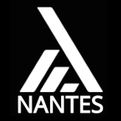

% Méthodes gardées en OCaml \newline ou l'utilisation _maladroite_ d'un **GADT** en **OOP**
% {width="80px"} {width="80px"}
% **Xavier Van de Woestyne** \newline  `@vdwxv` - [`xvw.github.io/capsule`](https://xvw.github.io/capsule)


##

::: columns

:::: column

**Moi**

- **Xavier Van de Woestyne** (Belge, à Nantes depuis 2ans !)
- Développeur OCaml chez **Marigold** (_Layer2_ et _dApps_ pour **Tezos**)
- `@xvw` sur Github, `@vdwxv` sur Twitter

::::

:::: column

**LambdaNantes**

- dédié aux **langages applicatifs** (donc agnostique)
- REX, encodages, découvertes
- objectif de récurrence: ~1 par mois

::::

:::

##  Objectifs 

- Comprendre les **méthodes gardées** (comme une limite de l'OOP _mainstream_)
- Comprendre, _sommairement_, les **types algébriques généralisés**
- Se familiariser avec la notion **d'égalité de types locales**
- Comprendre un (ou plusieurs) usage(s) de `Refl`
- Faire la prommotion de **OCaml**\newline \newline

> La présentation propose une élaboration assez lente pour une **solution triviale**.


# Sur le **polymorphisme paramétrique** dans \newline les langages OOP à la Java

## En Java, on peut, au niveau de la classe:

::: columns

:::: column

**Paramétrer une classe par une autre:**
```java
class MyClass<T> { }


```
::::

:::: column

\pause
**Restreindre la variable de type**
```java
class MyClass<T extends S> {  }


```
::::

:::

\pause

::: columns

:::: column

**Multiplier les bornes**
```java
class MyClass<T extends A & B> { }

```
::::

:::: column

::::

:::

## En Java, on peut, au niveau de la méthode:

::: columns

:::: column

**Introduire des existentiels**
```java
class MyClass<A> {
  public <B> 
     MyClass<A> 
     map(Function<A, B> f) {}
}


```
::::

:::: column

\pause
**Restreindre la variable de type**
```java
class MyClass<A> {
  public 
     <B extends S> MyClass<A> 
     map(Function<A, B> f) {}
}


```


::::

:::

\pause

::: columns

:::: column

**Multiplier les bornes**
```java
class MyClass<A> {
  public 
     <B extends S & T> MyClass<A> 
     map(Function<A, B> f) {}
}


```

\pause
::::

:::: column
**Note sur la contrainte**

- `<B extends S> B f(B x)` : renvoie un `B`
-  `S f(S x)` : renvoie un `S`

::::

:::


## 

Le langage des génériques semble **très expressif** !


```java

interface List<A> { 
    List<A> cons(A x);
    <B> List<B> map (Function<A, B> f);
}

```

Pourrait se traduire par ce module en **OCaml**

```ocaml

module type List : sig 
  val 'a t
  val cons : 'a -> 'a t -> 'a t
  val map : ('a -> 'b) -> 'a t -> 'b t
end
```

## 

_Rah_, **l'OOP est plus clair** ! `chien.aboyer()` c'est tellement mieux que `aboyer(chien)`


## Augmentons la difficulté !

```diff
  module type List : sig 
    val 'a t
    val cons : 'a -> 'a t -> 'a t
    val map : ('a -> 'b) -> 'a t -> 'b t
+   val sum : int list -> int
+   val flatten : 'a list list -> 'a list
  end
```

## 

- On peut ajouter des contraintes sur **toute la classe**
\pause
- On peut ajouter des contraintes sur **les variables de méthodes polymorphes** \newline \newline
\pause


On ne peut pas, **au niveau d'une méthode**, préciser le **type du receveur**.

## Solution à la Java

**Sortir la méthode du corps de la classe**
```
public static <A> List<A> flatten(List<List<A>> l) { }
public static int sum(List<List<int>> l) {}


```

\pause

**En d'autres mots:** la représentation OOP est superieure... _jusqu'à ce que ça
ne marche plus_... (meh)

## Solution à la Java

**Autre soucis**

- En Java, les méthodes statiques dans une interface **doivent avoir un corps**
- Donc on est obligé **d'enrichir l'API** pour pouvoir décrire ces deux méthodes
  (ici, ajouter une méthodes `fold` devrait faire l'affaire) \newline \newline
  
> De plus, la **staticité est mal comprise en Java** et son partage est ambigu.


## **Kotlin** à la rescousse

> **Kotlin**: _A modern programming language that makes developers happier._ \newline \newline

- Un **meilleur Java**
- (offrant des idiomes "plus fonctionnels" et des outils de typage)
\pause
- Une version édulcorée de **Scala** (qui nécéssite des encodages très compliqué
  pour atteindre un niveau de généricité décent)

## Utilisation d'une méthode d'extension (aussi présente en C#)

```kotlin
fun <A> List<List<A>>.flatten () = ...
fun List<Int>.sum() = ...


```


- Les **méthodes d'extensions** permettent d'ajouter des méthodes à des classes
  existantes (même `final`)
- Elles permettent de **définir plus finement le receveur** (plus qu'avec une
  méthode "simple") \newline \newline
  
\pause

- Définie **en dehors** de la classe, donc impose potentiellement d'**échapper**
  des méthodes.
- Imposent parfois des schémas **d'importation plus complexes** (maquillées
  par l'IDE)

# Ce que l'on voudrait, des **méthodes gardées** \newline soit, spécifier le receveur, parfois, au niveau de la méthode

## 

**The Object-Oriented/Functional-Programming symmetry: theory and practice** \newline
par [Gabriel Scherer](https://gallium.inria.fr/~scherer/) \newline \newline

::: columns
:::: column
- Pose une symétrie entre l'OOP et la programmation fonctionnelle (avec des ADTs)
- Pose un regard sur les égalité de types
- présente cette syntaxe (en OCaml):

```ocaml

class type ['a] list = object
  method flatten : 'b list 
     with 'a = 'b list
end
```
::::
:::: column

::::
:::


## 

**Hoora**, OCaml dispose d'une syntaxe pour **déclarer des méthodes gardées** (c'est vraiment le meilleur langage du monde !) \newline \newline

\pause

Malheureusement, **c'était du pseudo-code**. OCaml, comme une grande partie (à
ma connaissance) des langages _mainstream_ ne supporte pas les méthodes gardées
_first-class_.


# Pas de soucis, proposons un **encodage** de cette fonctionnalité... avec un **GADT**

## Rappel sur les ADTs : les produits

Permettent de créer un regroupement de valeur de types différents (ou non) pour
construire des structures complexes.


```ocaml

type point = int * int
type human = { name : string; age: int } 


```


Les classes **sont des formes de produits**

## Rappel sur les ADTs : les sommes

Permettent d'unifier des types différents sous l'ombrelle d'un même type : 

```ocaml

type int_or_string = 
  | Int of int
  | String of string
  
let x : int_or_string = String "foo"

```
Encodables avec **des familles scellées** et de l'héritage.


## Ils permettent de décrire toutes sortes d'outils

::: columns
:::: column
```ocaml
type coord = 
  | Point2D of { x: int; y: int }
  | Point3D of { 
       x: int; y: int; z: int }

type color = Red | Green

type colored_point = color * coord
```
::::

:::: column
```ocaml
type 'a list = 
  | Nil
  | Cons of ('a * 'a list)
```
::::

:::

## Un GADT (type algébrique généralisé)

Un **GADT** est une extension des types sommes qui permet d'indexer les
constructeurs d'une somme par des types spécifiques :

```ocaml

type _ int_or_string = 
  | Int : int -> int int_or_string
  | String : string -> string int_or_string
  
let x : string int_or_string = String "foo"
let y : int int_or_string = Int 42

```

## 

Les **contraintes** sont définies **au niveau du constructeur**

- `String` est un constructeur qui prend une `string` et renverra **toujours**
  une expression de type `string int_or_string`
- `Int` est un constructeur qui prend un `int` et renverra **toujours**
  une expression de type `int int_or_string`

## 

En complément, le _typeur_ attache une **égalité de type** qui permet d'être réifiée dans **de la correspondance de motifs**:

```ocaml
let int_to_string x = 
  match x with
  | Int an_integer -> string_of_int an_integer

val int_to_string : int int_or_string -> string

```

## 

Comme la correspondance de motif doit être de même type, on introduit un type
**localement abstrait** pour traiter les deux constructeurs de manière uniforme.


```ocaml
let to_string (type a) (x : a int_or_string) : string =
  match x with
  | Int an_integer -> string_of_int an_integer
  | String a_string -> a_string

val to_string : 'a int_or_string -> string 

```

## 

- Les **GADTs** permettent de **contraindre** un ou plusieurs types paramétrés
  par **constructeurs**
- Ils permettent de faire de la correspondance de motifs partielles (tout en
  produisant des fonctions totales)
- **Ils permettent de décrire plus d'invariants**

Ils peuvent servir à décrire des APIs plus sûres et ils sont présents en Haskell
et relativement en Scala.

# `Refl`, un constructeur de GADT très spécifique

## 

```ocaml

type (_, _) eq = 
  | Refl : ('a, 'a) eq


```

\pause

- Un seul constructeur possible ; `Refl`
- QUi malgré qu'il soit paramétré par deux types, ne permet de ne construire des valeur `('a, 'b) eq` **que si `'a` = `'b`**

\pause 

```ocaml

let x : (int, int) eq = Refl

let y : (int, string) eq = Refl
                           ^^^^
                           
Error: This expression has type (int, int) eq
       but an expression was expected of type (int, string) eq
       Type int is not compatible with type string
```

##

`Refl` permet de **formaliser l'égalité entre deux types syntaxiquement
différent**. Ici entre entier et un alias sur entier.


```ocaml
type other_int = int

let x : (int, other_int) eq = Refl
```

## En d'autres mots

> Si je peux fournir un `Refl` typé comme `('a, 'b) eq`, alors je sais, **par évidence** que `'a` est identique à `'b'.` \newline \newline


## Et pour l'abstraction ? 

```ocaml
module T : sig
  type t
end = struct
  type t = int
end

let x : (int, T.t) eq = Refl
                        ^^^^
Error: This expression has type (int, int) eq
       but an expression was expected of type (int, T.t) eq
       Type int is not compatible with type T.t


```

Ici, le compilateur ne peut pas **déduire** que `T.t` est `int` parce que `T.t`
est **abstrait**.

## 

Pas de soucis, il suffit de fournir un **témoins là où l'on peut instancier un `Refl`**:

```ocaml
module T : sig
  type t
  val eq : (int, t) eq
end = struct
  type t = int
  let eq = Refl
end

let x : (int, T.t) eq = T.eq
```

## 

Comme `Refl` est un témoins d'égalité **explicite** il provient avec quelques axiomes liés à l'égalité :\newline 

\pause

**L'égalité est symétrique**:

```ocaml
let symm (type a b) (Refl : (a, b) eq) : (b, a) eq = Refl

type other_int = int
let x : (int, other_int) eq = Refl
let y : (other_int, int) eq = symm x

```

## 

**L'égalité est transitive**:

```ocaml
let trans (type a b c) 
   (Refl: (a, b) eq) 
   (Refl: (b, c) eq) : (a, c) eq = Refl

type other_int = int
type yet_another_int = other_int
let x : (int, other_int) eq = Refl
let y : (other_int, yet_another_int) eq = Refl
let z : (int, yet_another_int) eq = trans x y

```

## 

**L'égalité est injective** (`('a t, 'b t) eq` alors `('a, 'b) eq`):


```ocaml

module Injective (T : sig type 'a t end) = struct 
  let make (type a b) 
      (Refl: ('a T.t, 'b T.t) eq) : ('a, 'b) eq = Refl
end

type other_int = int
module I = Injective (struct type 'a t = 'a list end)

let x : (int list, other_int list) eq = Refl
let y : (int, other_int) eq = I.make x


``` 

L'absence de **Higher kinded types** rend l'écriture un peu laborieuse

## 

Et comme l'instanciation de `Refl` pour `'a` et `'b` implique une évidence que le type `'a` est compatible avec `'b`, on a **du cast gratuit**:

```ocaml
let cast (type a b) 
   (Refl : (a, b) eq) (x : a) : b = x
```


## Pour terminer sur `Refl`

`Refl` est un **GADT**, qui,  comme pour les produits et les sommes : 

- Le couple `'a * 'b` est le **couple minimal pour décrire tout les produits**
- La somme `('a, 'b) either` est la **somme minimale pour décrire toutes les sommes** \newline

\pause


Nous avions dit qu'un GADT **était un type somme qui attachait une égalité de type locale à chacune de ses branches**. Donc `Refl` couplé à des sommes régulières suffit à décrire tous les GADTs[1]. \newline \newline


1. **Foundations for structured programming with GADTs**, Patricia Johann & Neil Ghani


# Mais quel rapport avec **les méthodes gardées** ?

## 

Considérons cette interface

```ocaml

class type ['a] obj_list = object 
  method length : int
  method concat : 'a obj_list -> 'a obj_list
end

```

## 

```ocaml

  class type ['a] obj_list = object 
    method length : int
    method concat : 'a obj_list -> 'a obj_list
+   method flatten : ????
+   method sum : ???
  end

```

\pause

Comment dire que pour ces méthodes, on voudrait **contraindre** le `'a` de notre
classe ? \newline \newline

\pause

En somme, dire que :

- dans le cas `sum`, `'a` = `int`
- dans le cas `flatten`, `'a` = `'b list`

## 

Mais... nous savons comment matérialiser cette **évidence** !

\pause 

```ocaml
class type ['a] obj_list = object 
    method length : int
    method concat : 'a obj_list -> 'a obj_list
+   method flatten : ('a, 'b list) eq -> 'b list
+   method sum : ('a, int) eq -> int
  end
  
```

## 

Où `my_list` implémente `obj_list`:

```ocaml
let b = my_list [ [ 1 ]; [ 2 ]; [ 3 ] ]
let c = b#flatten Refl
let _ = assert ([ 1; 2; 3 ] = c)

let d = (my_list c)#sum Refl
let _ = assert (6 = d)
```

## Une utilisation qui échoue à la compilation

On tente de faire sum sur une liste de `string`

```ocaml
let b = O.my_list [ "foo"; "bar" ]
let c = b#sum Refl
              ^^^^
Error: This expression has type (string, string) eq
       but an expression was expected of type (string, int) eq
       Type string is not compatible with type int
       
```

## Une utilisation qui échoue à la compilation

Ou de flatten sur une liste déjà `flatten`

```ocaml
let c = (O.my_list [ 1; 2; 3; 4 ])#flatten Refl
                                           ^^^^
Error: This expression has type (int, int) eq
       but an expression was expected of type (int, 'a list) eq
       Type int is not compatible with type 'a list

```

# Et voila ! \newline Nous avons vu un exemple de programmation avec du passage par évidence

## 

- `Refl` peut être utilisé dans d'autres cas. Son usage le plus fréquent et la
  conversion entre une représentation **non typée vers une représentation
  typée**

- En complément, les GADTs permettent de décrire brièvement des existentiels :
  `type e = Pack : 'a -> e`

- Ils permettent d'encoder finement des invariants

- Tous les langages (statiquement typés) devraient en avoir [1].

\pause

1. Mais comme tous les langages devraient être statiquement typés.

# Fin ! Merci ! Questions ? \newline [conversations ouvertes]: usage de l'OOP en OCaml. \newline [autre sujet de présentation]: usage plus concret des GADTs.
