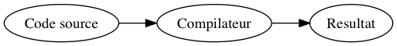
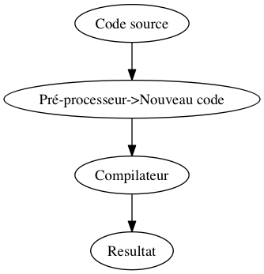

% Typesafe routing for Single-Page-App  with *pattern-matching* syntax
% **Ne pas se prendre la tête avec le système de types**
% `(LilleFP` $\oplus$ `(Lille |> Elixir)) 2`, Novembre 2016

# Genèse de la présentation

>  Elixir, le langage du futur ?

- Le langage du présent;
- présentation et historique des langages de programmation fonctionnel
  (Surement LilleFP3);
- envie de parler de **OCaml** ;
- projet issu du framework **Quasar** en **Js_of_ocaml** ;
- présenter une méthodologie plutôt qu'une technique de sioux ;
- routing "client", donc pas de verbe HTTP.

## Présentation très rapide Js_of_ocaml

# Application web monopage (SPA)

- Toute l'application sur une seule page ;
- ne recharger que les fragments de page nécéssaire ;

## Avantages
- Un seul point d'entrée dans l'application ;
- fluidifie l'expérience utilisateur ;
- découpler le client de l'API ;
- très commode pour les états interméidaires.

## Inconvénients
- Un seul point d'entrée dans l'application (naïvement);
- oblige l'activation de JavaScript (beuh...) ;
- indexation (mais est-ce encore vrai ?) et retours HTTP's ;
- sécurité ... (comme partout en somme) ;
- répartition des ressources (css/JavaScript externe).

# Le **routing** : Multipler les points d'entrées dans une page

> Inspiration du monde Backend en utilisant un système de routing via le **hash**.

## Propriétés du Hash dans le browser

- Change **L'url** sans faire de requête HTTP ;
- saute à un élément du DOM référé par son **nom** ou son **Id** ;
- empile la nouvelle url dans **l'historique**.

[**Exemple (hash1.html)**](hash1.html)

# Exemple de routing simple

-  `monsite.com` : index de l'application ;
-  `monsite.com#hello` : page hello world;
-  `monsite.com#hello-xvw` : page hello xvw ;

## Ingrédients 

-  Récupérer le hash courant ;
-  un **écouteur** sur le le changement de hash ;
-  une manière simple de définir une route.

# Premier essai de routing

- Utilisation de `window.location.hash` pour le hash ;
- `onload/onhashchange` pour écouter le changement de hash;


## Récuper le hash courant
```ocaml
let window   = Dom_html.window
let location = window##.location

let get_route () =
  let hash = Js.to_string (location##.hash) in
  if (String.length hash) > 1
  then Scanf.sscanf hash "#%s" (fun x -> x)
  else ""
  
```

---

## Ecouter le changement de hash

```ocaml
let watch_once event args f =
  let%lwt result = event args in
  let _ = f result in
  Lwt.return ()

let rec watch event args f =
  let%lwt _ = watch_once event args f in
  watch event args f

(* start the routing *)
let start f =
  let open Lwt_js.events in
  let _ = watch_once onload  () (fun _ -> f()) in
  let _ = watch onhashchange () (fun _ -> f()) in
  ()
```

---

## Exemple

> On peut maintenant très facilement lancer une fonction lors du **changement**
> de hash. (Le tout sans re-chargement.)

```ocaml
let () = Router.start (fun () ->
    let hash = Router.get_route () in
    alert ("Hash is changed : " ^ hash)
  )
```

---

## Simuler le multi-page

> On a presque tous les ingrédients pour créer plusieurs pages.

```ocaml
let () = Router.start (fun () ->
    let hash = Router.get_route () in
    if hash = ""         then alert "Page Index"
    else if hash = "foo" then alert "Page foo"
    else if hash = "bar" then alert "Page bar"
    else alert "Page inconnue"
  )

```

`Router.start` peut aussi être utilisé plusieurs fois et 
 simuler une notion de widget avec sa propre vérification des routes.

---

## Utiliser du *pattern-matching* pour plus de clareté 

> On peut écrire le tout de manière plus sexie avec du *pattern-matching*.

## Rappel sur le *pattern-matching*

```ocaml
let () = Router.start (fun () ->
    match Router.get_route () with
    | ""    -> alert "Page index"
    | "foo" -> alert "Page foo"
    | "bar" -> alert "Page bar"
    | x     -> alert ("Page " ^ x ^ ", inconnue")
  )

```
On peut facilement encoder des routes statiques, mais qu'en est-il des routes 
possédant des variables ? 

# Exposer des variables dans **l'url**

## Routes dans Phoenix

```ruby
scope alias: Application do
  get "/", ControllerA, :index, as: :root
  get "/b/:page", ControllerB, :show, as: :page
end
```

-  Verbe HTTP (logiquement non supporté coté client) ;
-  **Url** sous forme de chaine de caractère ;
-  déclaration de variables via `:ident`.

> Elixir étant dynamiquement typé, on ne trouve aucune information de 
> type... logique !

---

## Une solution fragile !

Comme le *pattern-matching* permet la déconstruction :

```ocaml
let split = Regexp.(split (regexp "-"))

let () = Router.start (fun () ->
    match split (Router.get_route ()) with
    | [""]               -> alert "Page index"
    | ["foo"]            -> alert "Page foo"
    | ["bar"]            -> alert "Page bar"
    | ["hello"; prenom]  -> alert ("Hello "^prenom)
    | [x]                -> alert ("Page " ^ x)
    | _                  -> alert ("Page inconnue")
  )

```

---

## Avantages

-  Très facile à écrire ;
-  offre la possibilité d'extraire rapidement des variables ;
-  propose une syntaxe assez simple à comprendre.

## Inconvénients

-  Limité sur le séparateur (`#hello-world-et-xavier` impossible) ;
-  tout est string (donc conversion à gogo);
-  donc non-typé.

# Un problème bien complexe :'(

-  OCaml est **statiquement typé** ...
-  les listes ne peuvent, à priori, pas être hétérogène ;
-  en Elm, par exemple, pas d'url variable !

Un semblant de solution serait, pour une url `#hello-NOM-AGE`,
de produire une liste de ce type

```ocaml
[String "hello-"; String nom; Int age]
```
C'est super lourd à écrire et la fonction pour produire cette liste est presque 
impossible !

---

## **GADT's** et super-pouvoirs
On peut se prendre la tête et tenter de résoudre le tout via le système de type. 
Les **GADT's** permettent de faire des choses magiques !

```ocaml
module VList =
struct
 type ('a,'b) t =
    | [] : ('b, 'b) t
    | (::) : 'c * ('a, 'b) t -> ('c -> 'a, 'b) t
end
(* WTF, une liste une hétérogène en OCaml *)
let li = VList.[1; "deux"; true]

```
> Bon, dans les faits, ça semble bien prise de tête ... et ...


# Le traitement de l'url est non-déterministe

-  `#page-INT-STRING`
-  `#page-STRING`

Comment générer une fonction capable de traiter ces deux cas de figure ?

> Pour $n$ routes, il faut potentiellement $n$ fonctions !
> (d'où l'intérêt de fixer le délimiteur...)

# Ecrire à la main ses routes avec des Regex

```ocaml
let () = Router.start (fun () ->
    match Router.get_route () with
    | route when test_regex_a route -> (..)
    | route when test_regex_b route -> (..)
    | _ -> (..)
  )

```

La seule solution viable semble d'écrire ses expressions régulières à la main...
pour `#int-INT` :

```ocaml
let r = "^int-(-?[0-9]+)$" in
match Router.get_route () with
| router_route_uri when
    Router.is_some
     (Regexp.string_match (Regexp.regexp r)
      router_route_uri 0)
  -> (..)
```

--- 

## Conclusion

-  Impossible à maintenir ;
-  code verbeux et difficile à lire ;
-  mais fonctionne !

> Le code est trop complexe à écrire pour chaque route, demandons à OCaml de le 
> générer.

# Une (LA) solution : pré-processer le code

> Bien que le code soit indéterminable au *runtime* il est possible de générer 
> à la compilation les fonctions qui manipulent des expressions régulières.

---

## Processus normal

> Flot classique de compilation.



---

## Processus pré-processé

> Flot de compilation avec un pré-processeur.



# Pré-processeurs en OCaml

- CamlP4 et CamlP5 (`-pp`)
- Ppx (`-ppx`)

## De CamlP4 à PPX

-  Retiré de la distribution standard en 4.01
-  `ppx`, une alternative (plus légère)

## Introduction de nouveaux éléments de syntaxe

-  Les attributs `[@]` ;
-  les extensions `[%]`

# Quelques exemples

## Ppx_deriving

Type Driven Developement

```ocaml
type geo = {
  lat : float [@key "Latitude"];
  lon : float [@key "Longitude"];
}
[@@deriving yojson]
```
[Voir sur Github](https://github.com/whitequark/ppx_deriving)

---

## Ppx_monad 

Haskell's do notation for OCaml

```ocaml

let concat_lines () =
  begin%monad
    put_line "input two lines";
    a <- get_line ();
    b <- get_line ();
    return (a ^ b)
  end
```
[Voir sur Github](https://github.com/rizo/ppx_monad)

--- 

## Ppx_measure

Typesafe units of measure

```ocaml
[%%use_measure]

type cm [@@measure]
and  m  [@@measure fun cm -> cm *. 100.  ]
and  km [@@measure fun cm -> cm *. 1000. ]

let%cm a = 1.0 
let%cm b = 2.0 
let c = Measure.(a + b)

let%km d = 2.0 
let e = Measure.(a + d) (* This code crash *)
```
[Voir sur Github](https://github.com/xvw/ppx_measure)

# Transformation sur l'AST de OCaml

Une extension de syntaxe OCaml consiste à :

-  Itérer récursivement sur le mappeur ;
-  transformer les expressions à la main ;
-  Enregistrer ou démarrer l'extension de syntaxe.

## Outils utiles

-  [ppx_tools : assistant pour écrire des PPX](https://github.com/alainfrisch/ppx_tools) ;
- [le code de parsing de OCaml](https://github.com/ocaml/ocaml/tree/trunk/parsing) ;
- `ocamlc -dsource ...` pour afficher le code-source produit avant la compilation.

# Retour sur le routing, définir une syntaxe

Il faut définir une syntaxe formelle pour définir les routes :

-  Utiliser le *pattern-matching* ;
-  spécifier via une extension que l'on veut matcher sur les routes ;
-  définir un format pour les routes à variables.

## Point d'entrée 

```ocaml
match [%routes] with 
| ...
```
Utiliser `%routes` permet de rapidement trouver tous les noeuds de `match with` sur
lequel il faut appliquer les transformation de syntaxe. `[%routes]` sera, à la 
compilation, remplacé par `Router.get_route ()`.

# Sémantique de définition d'une url

- Pour les routes "statiques", il ne faut pas d'extension ;
- syntaxe pour définir une route variable `[%route "ici-la-route"]`.

## Fonctionnement général

-  Le pré-processeur va remplacer les occurences de `[%routes]` dans des `match` ;
-  ensuite il va explorer les clauses du match pour remplacer les `| [%route str] ->` 
   par `| route_uri when regex_generée ->` (attention ou clause *when* existantes) ;

# Rendre les url's jolies

En replaçant le contenu d'une route par une expression régulière, il devient possible
d'écrire directement `[%route "une expression régulière"].

## Exposer des types primitifs 

-  `string`
-  `int`
-  `bool`
-  `char`
-  `float`

---

## Une syntaxe pour les urls

> Utiliser les accolades pour fixer un type précis.

```ocaml
let () = Router.start (fun () ->
    match [%routes] with
    | [%route "regex-(a|b)"] -> alert "a ou b"
    | [%route "int-{int}"] -> alert "test"
    | [%route "hello-{string}"] -> alert "hello"
    | [%route "{float}-{int}-{bool}-{string}"] -> 
	  alert "youhou"
    | ""-> alert "Index"
    | _ -> alert "Page inconnue"
  )
```

## Exemple d'erreur
` | [%route "{float}-{int}-{bool-{string}"] -> alert "youhou"`

> File "_none_", line 1:
> Error: Unknown type in route

# Le code généré après la substitution

[Lien vers Gist](https://gist.github.com/xvw/63b7a309fdd3baf4477c306eaaf324ea)

> La phase de pré-processing évite de devoir écrire du code compliqué et de le 
> répéter... de plus, comme le résultat de la substitution passe par la 
> compilation, *le type-checker* fait son travail.

# Extraire les variables

Maintenant que l'on peut définir des routes, il faudrait pouvoir exporter,
de manière *safe*, les variables (`{...}`).

- Comment garantir le typage de l'extraction des données ?
- Faut-il changer la syntaxe de définition des routes (pour nommer les variables) ?

---

# Profiter de la portée lexicale

Dans chaque membre du noeud `match ... with` on s'enfonce dans de nouveaux scopes.

## Générer une fonction d'extraction par clause

-  A chaque route qui **expose une (ou plusieurs) variables**, on génère une fonction
   capable d'extraire le résultat de l'expression régulière ;
-  comme le résultat de l'extraction est une chaine de caractère mais que l'on connait
   le type attendu, on peut directement convertir la donnée dans le type attendu.
   
---

```ocaml
let () = Router.start (fun () ->
    match [%routes] with

    | [%route "hello-{string}"] ->
      let nom = route_arguments () in
      alert ("Hello " ^ nom)

    | [%route "age-{int}-nom-{string}"] ->
      let age, nom = route_arguments () in
      alert 
		  (Printf.sprintf
			  "Hello %s, tu as %d ans" nom age)
      
    | ""-> alert "Index"
    | _ -> alert "Page inconnue"
  )

```

[Ce qui donne... sur Gist](https://gist.github.com/xvw/d55159330190ec90bbe874a37584d518)

---

On profite de la portée lexicale pour générer $n$-fonctions pour $n$-clauses.

## Les fonctions de coersions sont *unsafe*
  
  
[Voir sur Github](https://github.com/xvw/jsoo_router/blob/master/src/router.ml#L69)
  
  
Cependant, elles ne peuvent pas planter au runtime car elles sont conditionnées 
par l'expression régulière, ce qui garantit que les fonctions de coersions ne peuvent
jamais planter quand le code est compilé !

> Ces fonctions ne sont là que pour s'accorder avec l'interface des fonctions 
> d'expressions régulières et pour produire directement des valeurs du bon type.

# Résumé

## Flot général

-  On extrait tous les `match [%routes] with` pour ne travailler que sur eux ;
-  pour chaque clause `[%route ...]` on génère l'expression régulière correspondante
   et sa fonction d'extraction de valeur ;
-  on transforme `| [%route x] -> y` en `| route when regex -> let route_arguments () = ...`

--- 
## Conclusion

-  Le pré-processing permet de solutionner des problèmes de types velus ;
-  on a réussi à créer un outil de routing *typesafe* et simple à utiliser ;
-  le code est sur **opam** et utilisable dans n'importe quel projet **js_of_ocaml**.

# Au-delà d'un système de routing

Les pré-processeurs permettent :

-  D'incuber des fonctionnalités à venir ;
-  d'étendre le langage pour le spécifier ;
-  de générer du code à la compilation.

# Laïus ...

- Le web (et principalement le *front-end*) est un contexte **spécifique** ;
	-  Bouton précédent/suivant ;
	-  interactions externes au programme;
- spécialiser la grammaire d'un langage ne devrait pas être un mal !

# Fin

- [Code source de l'extension](https://github.com/xvw/jsoo_router) ;
- [Lien vers la présentation](http://xvw.github.io/talks/lillefp2/slides.pdf) ;
- questions/remarques ?

> Merci à tous d'être venu !
	   
