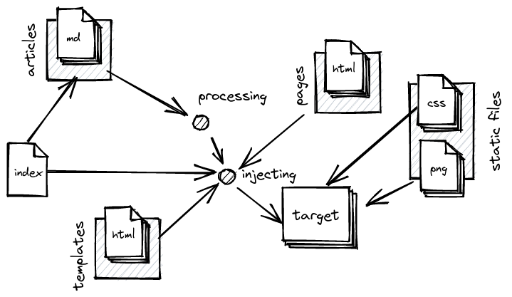
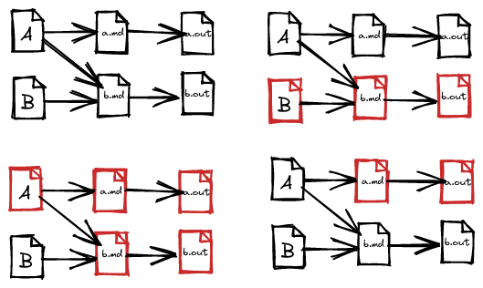

% YOCaml\newline(un _générateur_, de générateurs de sites statiques)
% **OUPS 01/2023**
% Xavier Van de Woestyne - **[github.com/xvw](https://github.com/xvw)** - [xvw.lol](https://xvw.lol)

# YOCaml

- Un _DSL_ pour construire un générateur de sites statiques (entre autres)
- très très (trop) générique et versatile
- diffusé sous licence **GPL 3.0**
- écrit en OCaml (... _logique_)
- relativement peu utilisé
- relativement mal documenté (même si on pourrait croire que non)\newline\newline

\pause

> Encore un générateur de sites écrit en **OCaml** ! Stog, Stone, Sesame,
> Soupault et j'en passe.\newline

\pause

Une des innovations de YOCaml est que c'est un générateur de sites statiques
dont le nom ne commence pas par la lettre **S**.

# Plan

- Contexte de création (et justification de certains choix qui semblent
  injustifiables)
- Un exemple de blog minimaliste
- Les pilliers de YOCaml
  - L'abstraction d'effets
  - le DSL avec **la capture de dépendances statiques**
  - généricités sur les métadonnées et les templates via des visiteurs et de la
    **validation applicative**
  - les **runtimes** et **plugins**
- Objectifs pour 2023

# Preface

> Preface is an opinionated library designed to facilitate the handling of
> recurring functional programming idioms in OCaml.\newline \newline Par [Didier
> Plaindoux](https://github.com/d-plaindoux), [Pierre
> Ruyter](https://github.com/gr-im) et moi\newline

- Une bibliothèque _pour programmer comme en Haskell_
- conçue à des fins pédagogiques
- après un premier usage sur un projet personnel\pause
- **inutilisable sur beaucoup d'aspects**\newline\pause

C'est pour ça que **YOCaml** a été conçu: **expérimenter l'expérience
utilisateur** de Preface avec un projet qui utilise des abstractions un peu
moins populaires dans _le monde des blog-posts_.

#

Ce qui explique parfois **des choix relativement peu pragmatiques**.
\newline\newline\pause Parce que pour **expérimenter l'expérience utilisateur**
de Preface, nous avons conçu un outil à **l'expérience utilisateur
douteuse**...\newline\pause

Mais après un an, YOCaml est un peu utilisé et certains (dont moi) en sont même
satisfait !

# Un exemple de blog très simple

&nbsp;&nbsp;&nbsp;&nbsp;&nbsp;&nbsp;&nbsp;&nbsp;&nbsp;&nbsp;&nbsp;&nbsp;&nbsp;&nbsp;
{width="400px"}

# Un exemple de blog très simple

On commence par définir **destinations** :

```ocaml
open YOCaml

module Target = struct
  let root     = "_site"
  let css      = "css"      |> into destination
  let images   = "images"   |> into destination
  let articles = "articles" |> into destination
end
```

# Un exemple de blog très simple

Ensuite on choisi :

- le langage de **markup**
- le traitement des **métadonnées**
- le moteur de **gabarits**
- le **runtime** à utiliser

```ocaml
module Markup   = Yocaml_markdown
module Parser   = Yocaml_yaml
module Tpl      = Yocaml_jingoo
module Runtime  = Yocaml_unix
```

# Un exemple de blog très simple

Définition de premières **règles assez simples** :

```ocaml
let move_css =
   process_files
     ["css/"]
     (with_extension "css")
     (fun file -> Build.copy_file ~into:Target.css file)

let move_images =
   let open Preface.Predicate in
   process_files
     ["images/"]
     (    with_extension "png"
       || with_extension "jpg"
       || with_extension "svg")
     (fun file -> Build.copy_file ~into:Target.images file)
```

# Un exemple de blog très simple

Maintenant on voudrait traiter les articles :

- parcourir tous les fichiers `.md` de `articles/`
- construire un nouveau nom: `title.md` -> `title.html`
- transformer l'article de `markdown` à `html`
- appliquer des templates

# Un exemple de blog très simple

```ocaml
let article_filename file =
  let html_name = replace_extension (basename file) "html" in
  html_name |> into Target.articles

```

```ocaml
let () =
  let computed = (article_filename "test.md")
  and expected = "_site/articles/_test.html" in
  assert (String.equal expected computed)
```

#

```ocaml
let read_article file =
  Parser.read_file_with_metadata
    (module Metadata.Article)
    file

let apply_article template =
  Tpl.apply_as_template
    (module Metadata.Article)
    template
```

#

```ocaml
let create_article file =
  let open Build in
  let target = article_filename file in
  create_file target (
     read_article file
     >>> snd Markup.to_html
     >>> apply_article "templates/article.html"
     >>> apply_article "templates/layout.html"
     >>> drop_metadata
   )

let articles =
  process_files ["articles/"] (with_extension "md") create_file
```

# Groupons tout ensemble

```ocaml
let () =
  Logs.set_level ~all:true (Some Logs.Debug);
  Logs.set_reporter (Logs_fmt.reporter ())

let () =
  Runtime.execute (css >> images >> articles)
```

# Améliorations mineures

```ocaml
+ let watch_binary = Build.watch Sys.argv.(0)

  let create_article file =
    let open Build in
    let target = article_filename file in
    create_file target (
+      watch_binary
+      >>> read_article file
       >>> snd Markup.to_html
       >>> apply_article "templates/article.html"
       >>> apply_article "templates/layout.html"
       >>> drop_metadata
     )
```

# C'est tout de même bien complexe

- On a parcouru des fichiers
- utilisé des bibliothèques écrites par d'autres personnes
- pourquoi le DSL est si conflictuel ?

# YOCaml assure, approximativement la **minimalité**

Essayer de ne reconstruire que les fichiers qui doivent être reconstruits.\newline

&nbsp;&nbsp;&nbsp;&nbsp;&nbsp;&nbsp;&nbsp;&nbsp;&nbsp;&nbsp;&nbsp;&nbsp;&nbsp;&nbsp;&nbsp;&nbsp;&nbsp;&nbsp;
{width="300px"}

#

```ocaml
type ('a, 'b) t = {
   deps : Deps.t
;  task : 'a -> 'b Effect.t
}
```

On **associe une action** (une tâche), à **un ensemble de dépendances**

#

```ocaml
module Deps = struct
  module S = Set.Make (String)

  let of_list = S.of_list
  let singleton = S.singleton

  include Preface.Make.Monoid.Via_combine_and_neutral (struct
    type t = S.t
    let neutral = S.empty
    let combine = S.union
  end)
end
```

# Effect.t

> Utilisation d'un **free monade** pour décrire un ensemble d'effets à
> interpréter **à postériori**.

# Un exemple très simple

```ocaml
type _ operation =
  | Print : string -> unit operation
  | Read : string operation

module Effect = struct
  include Preface.Make.Freer_monad.Over
    (struct type 'a t = 'a operation end)

  let print message = perform (Print message)
  let read read     = preform Read
end
```

# Définition d'un programme

```ocaml
let program =
  let open Effect in
  let* ()   = print "Hello World" in
  let* name = read in
  print ("Hello " ^ name ^ " !")
```

# Interprétation du programme

```ocaml
let handler : type a. (a, 'b) Effect.handle =
 fun continue -> function
  | Print message ->
    print_endline message;
    continue ()
  | Read ->
    let line = read_line () in
    continue line
```

# Exécution du programme

```ocaml
let () = Effect.run { handler } program


```

\pause

- Ça génère du code relativement peu performant...
- mais dans le cas de YOCaml ... ça passe
- on bénéficie d'outils intéressants (comme `Traverse`)
- on peut être agnostique de la platforme d'exécution\pause

```ocaml

external console : unit -> hook Js.t = "caml_js_get_console"

let handler_js : type a. (a, 'b) Effect.handle =
 fun continue -> function
  | Print message ->
    (console ()) ## log (Js.string message)
    continue ()
  | _ -> etc ...
```

# Effets définis par YOCaml

```ocaml
type 'a op =
  | File_exists : filepath -> bool op
  | Get_modification_time : filepath -> int Try.t op
  | Read_file : filepath -> filecontent Try.t op
  | Write_file : (filepath * filecontent) -> unit Try.t op
  | Read_dir : (filepath * filepath predicate) -> filepath list op
  | Log : string -> unit op
  | Throw : Error.t -> 'a op

 let failable eff =
   let* result = eff in
   Result.fold ~ok:return ~error:throw result
```

#

L'interprétation des **effets** est cachée à l'utilisateur au moyen des
`runtimes` qui doivent respecter une API fixe `Yocaml.Runtime.RUNTIME`.

#

Maintenant on peut facilement savoir si un fichier doit être mis à jour en
fonction d'un ensemble de dépendances :

```ocaml
module Traverse = Preface.List.Monad.Traversable (Effect)

let get_mtimes list =
  List.map Effect.(fun file -> failable (get_mtime file)) list
  |> Traverse.sequence
```

#

```ocaml
let need_update deps target =
  let open Effect in
  let* exists = file_exists target in
  if exists
  then
    let* target_time = failable (get_mtime target) in
    let+ deps_times = get_mtimes (S.elements deps) in
    List.exists (fun deps_time -> deps_time > target_time) deps_times
  else return true
```

# On peut implémenter `create_file`

```ocaml
let create_file target { deps; task } =
  let open Effect in
  let* need_update = Deps.need_update deps target in
  if need_update
  then
    let* () = log "need to be created" in
    let* content = task () in
    failable (write_file target content)
  else log "nothing to do"
```

# On peut maintenant définir des outils sur notre type `t`

```ocaml

let no_task = { deps = Deps.neutral; task = Effect.return }

let read_file filepath =
  let open Effect in
  { deps = Deps.singleton file
  ; task = (fun () -> failable @@ read_file filepath)
  }

let lift f = {
  deps = Deps.neutral
; task = (fun x -> Effect.return @@ f x)
}
```

# Par contre, on est vite limité

```ocaml
let rule = create_file "my_page.html" (
  read_file "my_page.markdown"
)
```

On voudrait pouvoir composer deux tâches et que leurs dépendances soient
unifiées.

# Composer deux tâches

```ocaml
let compose a b =
  let open Effect in
  let deps = Deps.combine a.deps b.deps
  let task = a.task <=< b.task in
  {deps; task}
```

# Groupons tout ensemble

```ocaml

module C = Preface.Make.Category.Via_id_and_compose (struct
  type nonrec ('a, 'b) t = ('a, 'b) t
  let id = no_task
  let compose = compose
end)

include Preface.Make.Arrow.Over_category_and_via_arrow_and_fst
  (Category) (struct
    type nonrec ('a, 'b) t = ('a, 'b) t
    let arrow = lift
    let fst a =
      let open Effect in
      { deps = a.deps
      ; task = (fun (x, y) -> a.task x >|= (fun r -> r, y))
      }
  end)
```

# Ce qui donne accès à tout un tas d'opérateurs et de fonctions

```ocaml
(>>>) (<<<) (^>>) (>>^) (^<<) (<<^) fst snd (&&&) ( *** )
```

Mais où, en pratique, on ne se sert que de `>>>`, `>>^` et `fst/snd`. (Il est
aussi possible d'ajouter de l'exécution conditionnelles en implémentant une
interface un peu plus riche).

- Avec ces opérateurs on peut construire des _pipelines_ (comme vu en
  introduction)
- Comme la tâche renvoie un `'b Effect.t` on peut toujours décider de sa
  stratégie d'interprétation\newline

\pause

Par contre ça impose de programmer en **point-free** et les `let operators` ne
sont pas suffisament expressif apporter du sucre syntaxique.

# Traitement générique des à-côté

Pour être générique, on voudrait ne pas imposer le format de **métadonnées**
(Yaml, Sexp, Json, Toml) et le **moteur de gabarits** (Jingoo, Mustach).\newline
\pause
Ce sont les même face d'une même pièce :

- les métadonnées doivent être _parsées_ et projetées dans une valeur d'un type donné
- le moteur de gabarit provisionne cette valeur pour faire de la substitution.

#

YOCaml abstrait la notion d'arbres dans une représentation proche de `Jsonm` et
fournit 4 signatures de modules :

## Pour les créateurs de plugins

- `Yocaml.Key_value.DESCRIBABLE` pour des données à injecter dans un **gabarit**
- `Yocaml.Key_value.VALIDABLE` pour des données destinées à être **validées**

## Pour les consomateurs de plugins

- `Yocaml.Metadata.READABLE` pour être _parsée_ depuis des métadonnées
- `Yocaml.Metadata.INJECTABLE` pour être _injectée_ dans un template

# Par exemple pour `Metadata.Article`

- On voudrait pouvoir parser ses métadonnées
- on voudrait pouvoir l'injecter dans un template

#

```ocaml
type t = {
  title: string
; desc: string
; tags: string list
; date: Date.t
; co_author: string option
}
```

#

Définir sa stratégie d'injection

```ocaml
let inject (type a) (module D : DESCRIBABLE with type t = a) article =
  D.[
    "title"     , string article.string
  ; "desc"      , string article.desc
  ; "tags"      , list (List.map string tags)
  ; "date"      , object_ (Date.inject (module D) date)
  ; "co_author" , Option.fold ~none:null ~some:string title
  ]
```

#

Définir sa stratégie de lecture

```ocaml
let from (type a) (module V: VALIDABLE with type t = a) obj =
  V.(object_and (
    let open Validate.Applicative in
    let+ title = required string "title" obj
    and+ descc = required string "description" obj
    and+ tags  = optional_or ~default:[] (list_of string) "tags" obj
    and+ date  = required (Date.from (module V)) "date" obj
    and+ co    = optional string "co_author" obj in {
      title; description; tags; date; co_author = co
    }
  ))
```

#

Ce qui permet :

- d'utiliser le même code de générateur, même si l'on décide de changer d'outils
- d'être relativement indépendant des bibliothèques que l'on décide d'utiliser

# Plugins

## Yocaml_markdown

> basé sur **OMD**

## Yocaml_jingoo

> Moteur de gabarits basé sur **ocaml-jingoo**

## Yocaml_mustach

> Moteur de gabarits basé sur **ocaml-mustach**

## Yocaml_yaml

> Parser de métadonnées basé sur **ocaml-yaml**

# Runtimes

## Yocaml_unix

> Le runtime par défaut, qui embarque aussi un serveur de prévisualisation (basé
> sur **cohttp**)

## Yocaml_git

> Un runtime paramétré par un runtime source (Yocaml_unix) qui construit la
> cible dans un repo git (basé sur **git-kv**, **lwt** et d'autres bibliothèque
> **mirage**)

## (**WIP**) Yocaml_fs

> En cours de développement, un runtime, paramétré par un runtime source, qui
> construit une bibliothèque OCaml capable de servir le site, adéquat pour être
> embarqué dans un MirageOS.

# Pré-conclusion

Même si l'API de YOCaml est un peu laborieuse il est possible de faire des sites
statiques de manière **assez flexible** et la bibliothèque prend très peu de
décisions à la place de l'utilisateur ! Il y a des exemples:

- [Exemples YOCaml](https://github.com/xhtmlboi/yocaml/tree/main/examples)
- [Le site de l'auteur principal](https://github.com/xhtmlboi/blogger)
- [Le site de Romain](https://github.com/dinosaure/blogger)
- [L'historique de LambdaLille](https://github.com/lambdalille/history)
- [Mon site web](https://github.com/xvw/capsule)
- [Et d'autres sur la doc](https://yocaml.github.io/doc/yocaml/index.html)

# Objectifs pour 2023

- Passer à OCaml 5 et remplacer `Effect` par (probablement) `Eio`
- repasser sur toute l'API pour l'uniformiser
- améliorer la gestion d'erreurs
- faire une documentation claire et faire des tutoriels
- implémenter pleins de _plugins_\newline\newline

On est très ouvert concernant les retours, les suggestions et les
contributions.\newline\newline\pause

## Fin

> Questions, remarques ?
